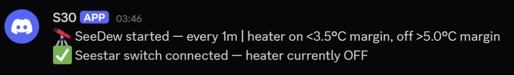
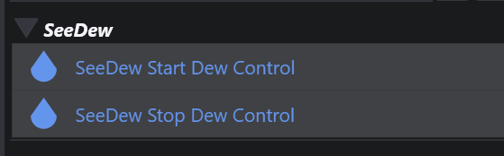

# NINA SeeDew Plugin

_NINA 3.x plugin that automates Seestar dew-heater control from connected weather data with hysteresis thresholds._

SeeDew automatically controls the dew heater on a Seestar telescope using weather data already connected in NINA.

It monitors the dew point margin (`temperature - dew point`) and applies hysteresis to avoid rapid toggling:

- Heater turns ON when margin is below the ON threshold
- Heater turns OFF when margin is above the OFF threshold

## Version

Current plugin version: `1.4.1.0`

## Features

- Automatic dew heater control using NINA weather and switch mediators
- Configurable ON/OFF thresholds and poll interval
- Dockable status panel with live readings, heater state, and service log
- Sequencer instructions:
  - `SeeDew Start Dew Control`
  - `SeeDew Stop Dew Control`
- Optional Discord webhook notifications for start/stop and state changes
- Session log files written under `%LOCALAPPDATA%\NINA\SeeDew`

### Discord notification example

With webhooks configured, SeeDew can post start/stop details and switch status to a channel:

## Requirements

- NINA 3.x (minimum application version `3.0.0.1001`)
- A connected weather source in NINA (temperature and dew point)
- Seestar switch connected in NINA Switch panel

## Install

Since SeeDew is not currently in the NINA plugin repository, install it manually:

1. Create this folder if it does not exist:
   - `%LOCALAPPDATA%\NINA\Plugins\3.0.0\SeeDew\`
2. Put `NINA.Plugin.SeeDew.dll` in that folder — either unzip it from the **GitHub Release** asset (`NINA.Plugin.SeeDew-*.zip` contains **only** that DLL), or copy it from `NINA.Plugin.SeeDew\bin\Release\net8.0-windows\` after a local Release build.
3. Restart NINA.

NINA loads plugins **in-process** and already ships the shared dependencies SeeDew uses, so the release zip does **not** mirror a full `dotnet publish` tree (unlike some plugins that ship extra runtimes or hosted UI stacks). See `scripts/Build-ReleaseZip.ps1` for the packaging step used in CI.

## Usage

1. Connect your weather source and Seestar switch in NINA.
2. In plugin options, set thresholds/poll interval — changes are saved automatically.
3. Add sequence items (under **SeeDew** in the Advanced Sequencer):

   

   - `SeeDew Start Dew Control` after device connections
   - `SeeDew Stop Dew Control` before disconnections
4. Optionally monitor the dockable SeeDew status panel during runs.

## Settings

Settings are persisted automatically to:

- `%LOCALAPPDATA%\NINA\SeeDew\settings.json`

Sequencer instructions (`SeeDew Start/Stop Dew Control`) reload this file before they run, so option changes are picked up on the next sequence execution without restarting NINA.

## Notes

- Plugin identity GUID is stable and must not be changed after publish.
- Existing dependency warnings (for some transitive packages) may appear at build time, but current Release builds succeed.

## Support

If you use and like anything I've done, support on [Ko-fi](https://ko-fi.com/turnpike47298) is appreciated to encourage me to keep going!